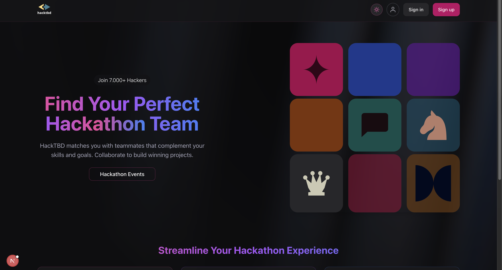

# FrontendWeb

This repository contains the frontend codebase for **HackTBD**, built using **Next.js** with **TypeScript**. The goal is to provide a fast, efficient, and user-friendly experience for hackathon participants and organizers.

## Technology Stack
- **TypeScript** – Statically typed JavaScript for better maintainability. Please refer to [Google Style Guide](https://google.github.io/styleguide/tsguide.html)
- **ESLint** – Linter for code consistency and best practices
- **Tailwind CSS** – Utility-first CSS framework for styling

## Demo
Lading Page



Hackathons Events


Sign In/ Sign Up


User Profile


## Details Documentation (by DeepWiki)
- For details documentation of the architecture and everything else, please check here: [DeepWiki](https://deepwiki.com/HackTBD/FrontendWeb)

## Getting Started

### 1. Install Package Manager: **pnpm**

We use **pnpm** instead of **npm** or **yarn** because:

- **Faster installs** due to efficient caching
- **Less disk space usage** by storing dependencies globally
- **Better monorepo support** (we don't need this)

### Install **pnpm** globally

If you haven't installed **pnpm**, run:

```sh
npm install -g pnpm
```

### Update **pnpm**

```sh
pnpm self-update
```

### 2. Install **Node.js**

Make sure you have an up-to-date version of **Node.js** installed.

#### Install Node.js (if not installed)

- Download and install from [nodejs.org](https://nodejs.org/) **or**
- Use **nvm** (Node Version Manager):
  ```sh
  nvm install --lts
  ```

#### Update Node.js

```sh
nvm install-latest-npm
```

---

### 3. Install Dependencies

At the root level of this repository, run:

```sh
pnpm install
```

This will install all necessary **node_modules** for the project.

---

## Available Scripts

| Command      | Description                                                       |
| ------------ | ----------------------------------------------------------------- |
| `pnpm dev`   | Start the development server with **Turbopack** for faster builds |
| `pnpm build` | Create an optimized production build                              |
| `pnpm start` | Start the production server after building                        |
| `pnpm lint`  | Run ESLint to check for code issues                               |

---

## Development Notes

- Use `pnpm` for all commands instead of `npm` or `yarn`.
- Make sure **Node.js** and **pnpm** are installed and updated before running the project.
- Tailwind CSS is used for styling—refer to `postcss.config.mjs` for customization.
- **ESLint** is used for code consistency and best practices. Run `pnpm lint` before committing changes.
- **Prettier** is used for code formatting. Refer to the [Prettier Guide](Documentation/Developer%20Guide/prettier.md) for setup instructions.
- **Codegen** is used for generating GraphQL types. Refer to the [Codegen Guide](Documentation/Developer%20Guide/codegen.md) for setup instructions.

## Next.js Default README

This is a [Next.js](https://nextjs.org) project bootstrapped with [`create-next-app`](https://nextjs.org/docs/app/api-reference/cli/create-next-app).

### Getting Started

First, run the development server:

```bash
npm run dev
# or
yarn dev
# or
pnpm dev
# or
bun dev
```

Open [http://localhost:3000](http://localhost:3000) with your browser to see the result.

You can start editing the page by modifying `app/page.tsx`. The page auto-updates as you edit the file.

This project uses [`next/font`](https://nextjs.org/docs/app/building-your-application/optimizing/fonts) to automatically optimize and load [Geist](https://vercel.com/font), a new font family for Vercel.

## Learn More

To learn more about Next.js, take a look at the following resources:

- [Next.js Documentation](https://nextjs.org/docs) - learn about Next.js features and API.
- [Learn Next.js](https://nextjs.org/learn) - an interactive Next.js tutorial.

You can check out [the Next.js GitHub repository](https://github.com/vercel/next.js) - your feedback and contributions are welcome!

### Deploy on Vercel

The easiest way to deploy your Next.js app is to use the [Vercel Platform](https://vercel.com/new?utm_medium=default-template&filter=next.js&utm_source=create-next-app&utm_campaign=create-next-app-readme) from the creators of Next.js.

Check out our [Next.js deployment documentation](https://nextjs.org/docs/app/building-your-application/deploying) for more details.

## Naming Convention

(Airbnb Guide) [https://github.com/airbnb/javascript] or (Rajitha's Medium) [https://rajithasanjayamal.medium.com/naming-conventions-best-practices-in-react-37624d020288]

- **Pascal Case**
  - Components files, files that part of rendering unit of the website
  - Interfaces
  - Type Alias
  - Enum name
- **Camel Case**
  - Folders
  - Non-components files
  - Function name
  - Variables name
  - Constant (initialized in run-time)
  - Enum name that describe value
- **Screaming Snake Case**
  - Hard-coded Constant
  - Enum value

## Extra Tools/ Resources

1. (Svg Path Editor)[https://yqnn.github.io/svg-path-editor/]: use to visualize svg files
